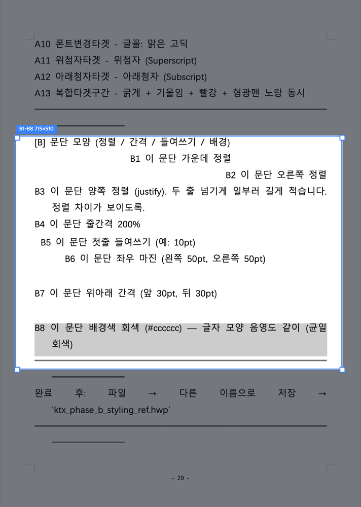

<h1 align="center">claw-hwp</h1>

<p align="center">
  한글 문서(<b>.hwp · .hwpx</b>)를 <b>Claude · Codex로</b> 읽고 · 만들고 · 고치는 도구<br/>
  한컴오피스가 없어도, 코딩을 몰라도 됩니다.
</p>

<p align="center">
  
  <a href="LICENSE"></a>
</p>

<p align="center">
  <strong>한국어</strong> · <a href="README_EN.md">English</a>
</p>

---

## 이게 뭔가요?

회사에서 한글(.hwp) 문서, 많이 쓰시죠? 보고서·공문·계획서·표가 잔뜩 든 서식들요.

`claw-hwp`를 설치하면 **Claude·Codex 같은 AI에게 한국어로 말하듯 시키기만 하면** 한글 문서를 직접 읽고, 새로 만들고, 고쳐 줍니다.

> - "이 보고서 표에서 매출 칸을 120억으로 바꿔줘"
> - "제목은 파란색 굵게, 본문은 맑은 고딕으로 해줘"
> - "이 문서 본문을 2단으로 나눠줘"
> - "표 하나 만들고 꼬리말에 쪽번호 넣어줘"

이렇게 말하면 됩니다. 결과 파일은 **한컴오피스나 한컴독스(한글 웹)에서 그대로 열립니다 — 안 깨져요.**

한컴오피스 · LibreOffice · 윈도우 전용 프로그램 — **아무것도 필요 없습니다.**

## 누구를 위한 건가요?

- 한글(.hwp) 문서를 자주 다루는 **회사원 · 공무원 · 실무자**
- Claude Code / Codex 등 AI 에이전트를 쓰는 분
- **코딩을 몰라도 됩니다** — 한 번 설치하고, 말로 시키면 돼요.

---

## 뭐가 되나요?

한글 문서에서 자주 쓰는 기능을 기준으로, **지금 되는 것(✅)** 을 정리했어요.

### 📖 읽기
- ✅ 문서 내용 · 표 · 정보 읽어 오기
- ✅ 표 안 셀 내용까지 통째로 뽑아 보기

### ✍️ 글자 꾸미기
- ✅ 굵게 · 기울임 · 밑줄 · 취소선
- ✅ 형광펜 · 글자색
- ✅ 글자 크기 · 글꼴(폰트)
- ✅ 위 첨자 · 아래 첨자
- ✅ 자간(글자 사이 간격) · 장평(글자 폭)
- ⬜ 외곽선 · 그림자 · 강조점

### 📐 문단 꾸미기
- ✅ 정렬 (왼쪽 · 가운데 · 오른쪽 · 양쪽 · 배분 · 나눔)
- ✅ 줄 간격
- ✅ 들여쓰기 · 왼/오른쪽 여백 · 문단 위아래 간격
- ✅ 문단 배경색
- ✅ 글머리표 · 문단 번호 · 수준 올리기/내리기

### 📊 표
- ✅ 표 만들기
- ✅ 셀 내용 입력 · 바꾸기
- ✅ 셀 배경색 · 테두리 · 대각선
- ✅ 셀 합치기 · 나누기
- ✅ 줄/칸 추가 · 삭제
- ✅ 셀 너비·높이 같게 · 세로 정렬

### 🧩 넣기
- ✅ 그림(이미지)
- ✅ 도형 (사각형 · 타원 · 선 · 호)
- ✅ **차트 — 20종** (막대 · 꺾은선 · 원 · 도넛 · 3D 등) + 행/열 데이터 직접 지정
- ✅ 글상자
- ✅ 수식
- ✅ 문자표(특수기호)
- ✅ 각주 · 미주
- ✅ 누름틀(입력 양식) · 하이퍼링크 · 책갈피
- ✅ 문단 띠
- ⬜ 메모 *(저장하면 사라지는 항목이라 제외)*

### 📄 쪽(페이지)
- ✅ 용지 크기 · 방향 · 여백
- ✅ 머리말 · 꼬리말 (글자)
- ✅ 쪽 번호 (머리말·꼬리말 × 왼쪽/가운데/오른쪽)
- ✅ 다단 (2단 · 3단)
- ✅ 쪽 나누기 · 단 나누기
- ⬜ 쪽 테두리 · 배경

### 🆕 만들기 · 고치기
- ✅ 새 문서 만들기 (.hwp · .hwpx)
- ✅ 기존 문서를 **원본 형식 그대로** 고치기 — 형식을 바꾸지 않으니 **안 깨져요**
- ✅ 미리보기
- ⬜ PDF · 워드(docx) 변환 *(다음 버전 예정)*

> 💡 **".hwp ↔ .hwpx 변환"은 사실 쓸 일이 거의 없어요.**
> .hwp는 .hwp로, .hwpx는 .hwpx로 — **받은 형식 그대로** 열고 고치고 저장하기 때문이에요. 형식을 굳이 바꾸는 변환 기능도 들어 있지만(표·글은 유지), 이미지 등 일부가 달라질 수 있어 **가급적 원본 형식 그대로** 쓰시길 권합니다.

> ✅ = 지금 바로 되는 기능 · ⬜ = 아직 안 되거나 다음 버전 예정이에요.

<!-- ↓↓↓ HWPX 팀이 단 메모 (HWP 팀이 정리/표현 다듬어 주세요. 사실관계만 적었습니다) -->

> **🔷 .hwpx 트랙 노트** — .hwp와 기능은 거의 같지만, .hwpx는 한컴독스(웹) 정규화를 더 타서 **아래 몇 가지만 다릅니다**:
> - **문단 배경색 · 문단 띠** 〔62·82줄〕: 한컴 웹이 *문단 단위* 테두리/배경을 지워버려서 **1칸 표로 우회**해 구현합니다 — 보이는 효과는 동일.
> - **글머리표 · 문단 번호** 〔63줄〕: 한컴 웹이 새 글머리표/번호를 지우는 문제가 있어 *지문(fingerprint) 맞춤* 처리를 넣어 동작시킵니다. 단 일부 리스트 작업에서 **항목이 가운데로 정렬되는 이슈**가 남아 있어요(수정 예정).
> - **강조점** 〔56줄〕: .hwpx도 ⬜ — 한컴 웹에서 저장 시 사라져 제외(동일).
> - **머리말 · 꼬리말** 〔87줄〕: .hwpx는 글자 **정렬(왼/가운데/오른쪽)** 까지 됩니다.
> - **글자·문단·쪽 꾸미기 전반**: .hwpx도 한컴 웹에서 **그대로 살아남도록** 처리 완료 — 글자 9종(굵게/기울임/밑줄/취소선/색/형광/크기/자간/글꼴), 문단(정렬·들여쓰기·줄간격·위아래 간격·여백), 쪽(가로세로·여백·다단) 라운드트립 검증.
> - **🎨 테마** 〔'테마' 섹션〕: .hwpx는 기본 테마 + `themes/*.md` 파일 테마를 합쳐 **여러 종**을 제공하고, **파일만 추가하면 테마를 늘릴 수 있어요**(마크다운 한 장).
> - **docx 변환** 〔97줄〕: .hwpx 쪽은 같은 내용을 **Word(.docx)로도** 만들 수 있는 길을 실험 중(별도 docx 스킬 활용).
>
> *(위 항목 외 글자/표/넣기/쪽 기능은 .hwp와 동일하게 동작합니다.)*

<!-- ───────────────────────────────────────────────────────────────
  HWPX 팀에게: 위 체크리스트는 .hwp 기준으로 정리했습니다. .hwp·.hwpx
  둘 다 되는 기능은 거의 맞춰놨어요. .hwpx에서만 다르거나 추가로 되는
  항목이 있으면 해당 줄 옆이나 이 아래에 보태 주세요.
─────────────────────────────────────────────────────────────── -->

---

## 🎨 테마 — 문서 느낌을 한 번에

제목 색과 글꼴을 **테마 하나로 통일**할 수 있어요. 정부 공문 느낌, 기업 보고서 느낌, 모던, 클린 등.

<p align="center"></p>

<table>
  <tr>
    <td align="center"></td>
    <td align="center"></td>
  </tr>
  <tr>
    <td align="center"></td>
    <td align="center"></td>
  </tr>
</table>

<!-- TODO(미디어): 위 4장은 임시 자리표시 이미지. 실제 테마 적용 전/후 스크린샷 + 실시간 적용 동영상(GIF)으로 교체 예정. -->

---

## 📝 서식 채우기

공문 · 신청서 · 계획서 · 이력서처럼 **자주 쓰는 표준 서식에 내 정보를 채워 넣는** 기능이에요. "이 신청서에 내 정보로 채워줘" 한마디면 성명·주소·연락처 같은 빈칸이 채워집니다.

### 🔒 개인정보는 안전하게
주민등록번호·사업자번호처럼 민감한 정보가 들어가죠. 그래서 이렇게 동작해요:
- **값을 채팅에 적지 않아요.** 내 정보는 내 컴퓨터 안 메모 파일에만 두고, **AI는 그 값을 들여다보지 않습니다** — 서식에 옮겨 적는 기능만 그 파일을 읽어요. (채팅에 주민번호를 붙여넣을 필요가 없어요.)
- 기본은 **쓰고 바로 지우기**(임시). 매번 적기 번거로우면 "저장해둬"라고 할 때만 내 컴퓨터에 보관하고, 원하면 언제든 지웁니다.
- 다 됐는지 확인할 때도 **값은 가린 채**(••••) 확인해요.

### 🔁 모양이 달라도 알아서 맞춰요
같은 정보라도 서식마다 칸 모양이 다르죠. 생년월일을 `970605`로 받는 곳, `97.06.05`로 받는 곳, 전화번호를 `010-1234-5678`·`01012345678`·`82)10-1234-5678`로 받는 곳 — **그 칸에 맞는 모양으로 알아서 바꿔** 넣어줍니다. 한 번만 적어두면 어느 서식이든 맞춰져요.

<!-- HWPX 팀에게: 서식 채우기(secure-fill)는 .hwp·.hwpx 공통 주제예요. 동작/보안 모델 공유: 값은 모델 컨텍스트 안 거치고 도구가 파일에서 직접 읽음, 기본 ephemeral, 영구는 opt-in. 같이 정리하면 좋겠습니다. -->

---

## 👀 결과를 눈으로 확인하기 — 한컴독스 캡처 *(선택)*

"고쳐 줬다는데, 진짜 한컴에서 잘 보이나?" — 이걸 **실제 화면 그대로 이미지로 확인**할 수 있는 도우미가 따로 있습니다: **`hancomdocs-capture`**.

- 동의하시면 처음 **딱 한 번** 브라우저 창이 떠서 한컴독스에 로그인합니다.
  *(비밀번호는 저장하지 않아요. 로그인 정보는 **내 컴퓨터에만** 남습니다 — 브라우저에 한 번 로그인해 두면 다음에 안 물어보는 것과 똑같아요. 그래서 한 번 해두면 다시 로그인 없이 계속 쓸 수 있어요.)*
- 그 다음부터는 문서를 자동으로 한컴독스에 올려서 **실제로 보이는 모습을 사진으로 찍어 옵니다.**
- 그 사진을 **사람도 보고, Claude도 직접 보고 확인**하기 때문에 — "말로만 됐다"가 아니라 **눈으로 검증된 결과**가 나옵니다. 그래서 **결과 품질이 확 올라갑니다.**

| 원하는 영역 고르기 | 확대해서 보기 |
|:---:|:---:|
|  |  |

> 없어도 기본 기능은 다 됩니다 — 이건 "눈으로 확인"을 더해 주는 선택 도우미예요. 설치는 바로 아래를 보세요.

---

## 📥 설치

> **Claude와 Codex 둘 다 됩니다** (둘 다 설치·동작 검증 완료). 같은 GitHub 저장소를 쓰고, 명령어만 각자 달라요. 본인 환경에 맞는 방법을 보세요.

### 일반 사용자 — Claude 데스크톱 앱 (Mac · Windows)

1. **Code** 탭에서 왼쪽 **Customize** 클릭
2. **개인 플러그인** 옆 **`+`** → **마켓플레이스 추가**
3. 아래 주소를 붙여넣고 **동기화(Sync)**:

   ```
   https://github.com/DoHyun468/claw-hwp
   ```

**끝!** 이제 한글 파일을 채팅에 올리거나 파일 이름을 말하면 자동으로 작동합니다.

> 💡 **이렇게 말해 보세요:** `report.hwp 보여줘` · `이 한글 파일 열어줘` · `회의록.hwp 에 한 줄 추가해줘`
> (추상적인 "설치해줘 / 설정해줘" 보다, **파일이나 파일명을 같이** 말하면 잘 작동해요.)

### 👀 "눈으로 확인" 도우미도 같이 *(선택)*

위에서 소개한 한컴독스 캡처를 쓰려면 — Claude Code(CLI)에서 한 줄:

```
claude plugin install https://github.com/DoHyun468/hancomdocs-capture
```

처음 한 번 한컴독스 로그인만 하면 계속 쓸 수 있어요.

### 🧑‍💻 코딩하시는 분 — Claude Code (CLI)

```bash
claude plugin marketplace add https://github.com/DoHyun468/claw-hwp
claude plugin install claw-hwp@claw-hwp
```

> 업데이트한 뒤에는 **새 세션(새 창)** 을 여세요 — 열려 있던 세션은 옛 버전으로 계속 동작합니다.

### 🤖 Codex 앱 — 똑같이 됩니다 ✅ *(검증 완료)*

Codex에서도 **같은 저장소를 그대로** 씁니다. 마켓플레이스로 추가해 설치하면 `claw-hwp:hwp` 스킬이 자동으로 로드되고, **미리보기 뷰어도 Codex 인앱 브라우저에서 옆에 떠요** (Claude Code 앱처럼).

```bash
codex plugin marketplace add https://github.com/DoHyun468/claw-hwp
codex plugin add claw-hwp@claw-hwp
```

> Claude는 `claude plugin …`, Codex는 `codex plugin …` — **명령어만 다르고 같은 저장소로 똑같이 설치**됩니다. (검증: 마켓플레이스 추가 → 설치 → `claw-hwp:hwp` 로드 → localhost 미리보기까지 정상)

---

## 🐞 문제가 있거나 안 되는 게 있으면

- 곧 **GitHub 이슈 페이지**로 오류를 바로 보낼 수 있게 만들 예정입니다. *(준비 중)*
- 그때까지는 [Issues](https://github.com/DoHyun468/claw-hwp/issues)에 **어떤 파일에서 무엇이 안 됐는지** 적어 주세요. 가능하면 그 한글 파일도 같이 올려 주시면 빠르게 고칠 수 있어요.

---

## 미리보기 — 고친 한글 문서를 바로 화면에서

여기서 **"미리보기"** 는 **고치거나 만든 한글(.hwp) 문서가 실제로 어떻게 생겼는지 화면에 그려서 보여주는 것**을 말해요. 읽기·만들기·고치기 자체는 어디서든 똑같이 되고, **이 한글 미리보기를 어디에 띄우는지만** 환경에 따라 다릅니다:

| 환경 | 한글 미리보기 |
|---|---|
| **Claude 앱(Code 모드) · Codex 앱** | 둘 다 같은 방식 — 앱 안에서 옆에 바로 표시 (localhost 미리보기) |
| **Claude Code (CLI · 터미널)** | localhost 미리보기를 클릭 링크로 → 외부 브라우저에서 |
| **Claude Cowork** | (원격이라 localhost를 못 띄워요) → github.io 뷰어에 파일 끌어 놓기 |

> 📄 **설치·로그인 없이 한글 파일을 그냥 열어 보기만** 하려면 누구나 — <https://dohyun468.github.io/claw-hwp/> 에 끌어 놓으면 브라우저에서 바로 보여요. (claude.ai 웹처럼 스킬이 안 깔리는 곳에서도 이 뷰어는 됩니다.)
> 🔍 **한컴과 100% 똑같이** 검토·편집하려면 — **한컴오피스(한글) 앱이나 한컴독스**에서 여세요. 이 한글 미리보기는 "작업 중 빠른 확인"용이고, 한컴 호환성 **검증**은 위 [한컴독스 캡처](#-결과를-눈으로-확인하기--한컴독스-캡처-선택)가 맡아요.

---

## 만든 기반

[rhwp](https://github.com/edwardkim/rhwp)(오픈소스 한글 형식 코어)로 문서를 읽고, 그 위에 **기존 파일을 원본 그대로 고치는 기능**과 **한컴오피스/한컴독스에서 안 깨지게 저장하는 기능**을 직접 더했습니다.

## 라이선스

MIT

<!-- ───────────────────────────────────────────────────────────────
  HWPX 팀에게 (README 공동 작성):
  - 이 README는 .hwp·.hwpx 공통으로 읽히게 썼습니다(기능 거의 맞춤).
  - .hwpx 전용 강점/차이를 덧붙이고 싶으면 여기나 해당 섹션에 추가해 주세요.
  - README_EN.md(영문)도 같은 구조로 맞추면 좋겠습니다.
─────────────────────────────────────────────────────────────── -->
